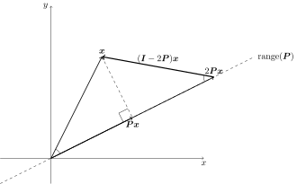
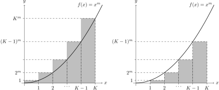

# tikz-archive
Archive of my PGF/TikZ works.

[](https://opensource.org/licenses/MIT)

[[]](./Householder_Reflector.tex)

[[]](./Integration_Trick_for_Series.tex)

## Compile method

```bash
lualatex --output-format=dvi <file_name>.tex
dvisvgm --no-fonts <file_name>
```

White background:
```tex
\special{background White}
```